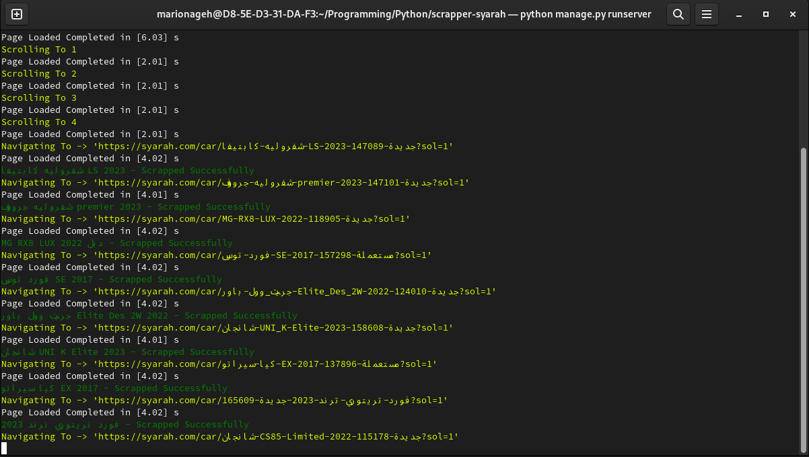
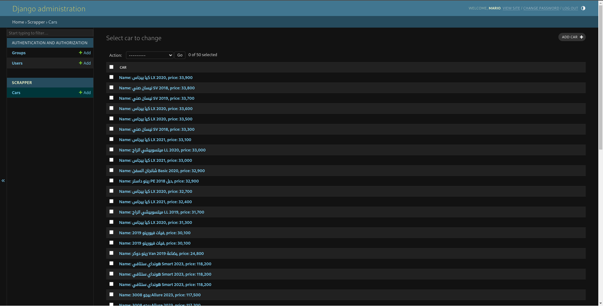
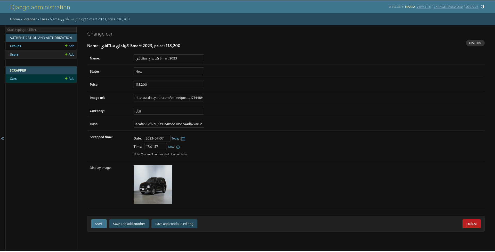
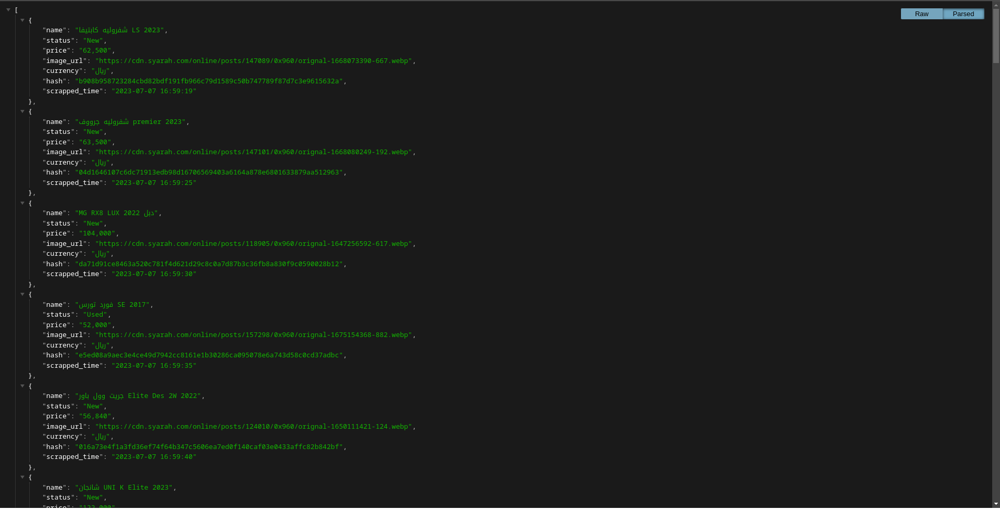

## Scrapper

It's A Scrapper Build With Python , Django Web Server 
to Monitor The Records Throw django-admin
base on Selenium

ues Docker For install selenium Driver , and chrome will install
automatic

Using Docker
------------
    docker build -t scrapper .
    docker run -it -p 8080:8000 scrapper

go to http://localhost:8080

**Extra Steps In Docker:**

- `docker ps` get the <container_id>
- `docker exec -it <container_id> /bin/bash` open bash in interactive mode
- `python manage.py createsuperuser` to create superuser 
- `http://localhost:8080/admin`

**How Scrapper Works**

- `services/scrapper_serivce.py`: launched when django server starts
and start to scrap data from website
, this service start to scrap depends on what is scrapped before
in database and how many item do you need depends on 
- it's handle the pagination by it own mechanism
------------------
    self.scrapper.collect_main_page_from_to(self.scrapper.memory.last_scrapped_item_number,
                                                50)
in the above method we scrape only `50 items` 
the above service by default have to scrap only `50 items`

**Scarp Whole Website**

- if you need to scrap the `full website` edit the above function to bee
------------------
    self.scrapper.collect_main_page_from_to(self.scrapper.memory.last_scrapped_item_number,
                                                float('inf'))

**To Scrap From Where You Scrapped**

(A) this code will scrap extra 50 item and it to DB
------------------
    self.scrapper.collect_main_page_from_to(self.scrapper.memory.last_scrapped_item_number,
                                                self.scrapper.memory.last_scrapped_item_number + 50)

**This Scrapper Has Own Mechanism For Continue form Where it stops**

if the scrapper stops due to any error, blocked ip, it will continue form where it's begin 
but you need to modify the above function to be Like (A) from

- it internally Handel Pagination
- Has Its mechanism to Wait Page till it loaded
- has function called `many_find` fo try all ways to find specific element 
in dom if no element found it raise ElementNotFoundInDom
- has function called `collect_main_page_from_to(self, from_item_number, to_item_number)` to
scrap items from , to based on it's order in website
- has function called `collect_main_page_link_until(self, number_of_items):` to
scrap items extra upon it's memory example 
_**if you crapped 50 item and call this function with 100 the total scrapped item
will be 150**_
- has function called `wait_for_page_fully_loaded` to wait till page fully loaded
- has function called `scroll` to scroll or paginate to next page

## **Use Django Admin** 
for observe inserted data

**Or user this Api** 
------------------------------
    http://localhost:8080/cars

this api will show you only 50 cars

**Images**

